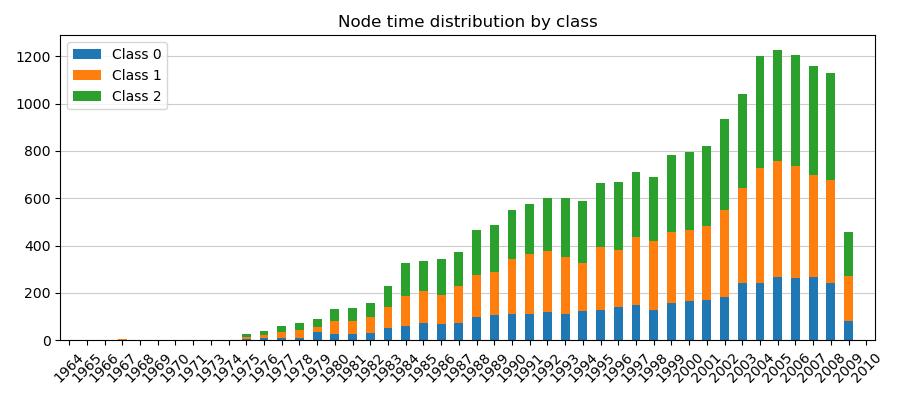
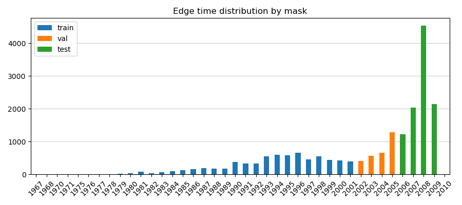

# PubMed-Temporal: A dynamic graph dataset with node-level features

[](https://doi.org/10.5281/zenodo.13932075)

Code to reproduce the temporal split for the PubMed/Planetoid graph dataset.

If you use this dataset in your research, please consider citing the paper that introduced it:

> Passos, N.A.R.A., Carlini, E., Trani, S. (2024). [Deep Community Detection in Attributed Temporal Graphs: Experimental Evaluation of Current Approaches](https://doi.org/10.1145/3694811.3697822). In Proceedings of the 3rd Graph Neural Networking Workshop 2024 (GNNet '24). Association for Computing Machinery, New York, NY, USA, 1–6.

___

## Dataset description

The dataset is split into train, validation, and test sets based on sequential disjoint time intervals (0.6, 0.2, 0.2).

> Note that the number of edges in the PyTorch Geometric dataset are doubled for the undirected graph.

### Node time distribution



### Edge time distribution



> Note that the first citation occurs in 1967, but the oldest paper is from 1964.

___

## Load dataset

### PyTorch Geometric

```python
from pubmed_temporal import Planetoid
# from torch_geometric.datasets import Planetoid  # NotImplemented

dataset = Planetoid(name="pubmed", split="temporal")
data = dataset[0]
print(data)
```

```python
Data(x=[19717, 500], edge_index=[2, 88648], y=[19717], time=[88648],
     train_mask=[88648], val_mask=[88648], test_mask=[88648])
```

### NetworkX

```python
import networkx as nx

G = nx.read_graphml("pubmed/temporal/graph/pubmed-temporal.graphml")
# G = nx.read_graphml("pubmed/temporal/graph/pubmed-temporal.gexf")
print(G)
```

```
DiGraph with 19717 nodes and 44335 edges
```

> Note that the directed graph contains 11 additional edges among papers that cite each other.

___

## Build dataset

The temporal split and edge masks for the train, validation, and test splits are already included in this repository.

In order to build it completely from scratch (requires [pubmed-id](https://pypi.org/project/pubmed-id)), run:

```bash
python build_dataset.py --workers 1
```

To build the dataset, the following steps are taken, aside from obtaining the required data from PubMed:

1. Download [original](https://linqs-data.soe.ucsc.edu/public/datasets/pubmed-diabetes/pubmed-diabetes.zip) PubMed graph dataset.
2. Build NetworkX object from dataset.
3. Obtain [Planetoid](https://pytorch-geometric.readthedocs.io/en/latest/generated/torch_geometric.datasets.Planetoid.html) node index map.
4. Relabel nodes to match Planetoid's index map.
5. Add weight vectors `x`.
6. Add classes `y`.
7. Add time steps `t`.
8. Verify if dataset matches Planetoid's.
9. Save temporal node index and split.

> Note that it might take a few hours to obtain metadata from PubMed, build the index mapping nodes to the Planetoid dataset, and finally process and save the temporal split.

___

## Extras

To plot the figures and table displayed above:

```bash
python extra/build_extra.py
```

Requires the `matplotlib` and `tabulate` packages installed.

___

### References

* [Query-driven Active Surveying for Collective Classification](https://people.cs.vt.edu/~bhuang/papers/namata-mlg12.pdf) (2012). Namata et al., Workshop on Mining and Learning with Graphs (MLG), Edinburgh, Scotland, UK, 2012.

* [Revisiting Semi-Supervised Learning with Graph Embeddings](https://arxiv.org/abs/1603.08861) (2016). Yang et al., Proceedings of the 33rd International Conference on Machine Learning (ICML), New York, NY, USA, 2016.